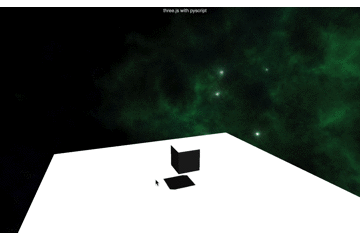
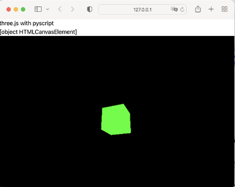
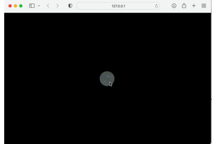
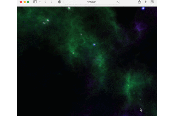

# pyscript with threejs

My first 3D programm with pyscript (https://pyscript.net)

## basic

A basic application with skybox

I learned many things about threejs from **SimoneDev**.

This is a port from his youtube tutorial  **Create JavaScript 3D World in 5 Minutes (or less)** https://www.youtube.com/watch?v=PPwR7h5SnOE 

Have a look.

Many things about styles from https://discoverthreejs.com

Thanks for the textures to https://opengameart.org/content/space-nebulas-skybox

<br><br><br><br><br><br><br><br><br><br><br><br><br><br>

## cube

<br><br><br><br><br><br><br><br>

## globe

Interactive globe with mouse

<br><br><br><br><br><br><br><br>

## sky

A simple skybox  

I learned many things from *How to Create a Skybox with Three.js*
https://codinhood.com/post/create-skybox-with-threejs @codinhood

Thanks for the textures to https://opengameart.org/content/space-nebulas-skybox

<br><br><br><br><br><br><br><br>


```Rust

```
